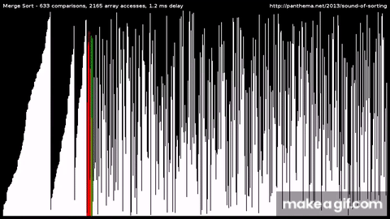

# Sorting Visualizer
Visualization of selection, insertion, and bubble sort algorithms in c/c++ with the [raylib](https://github.com/raysan5/raylib) library. 
Includes functionality to choose between each type of sorting algorithm, shuffle lines, and reset app.

Below are demonstrations:

# Selection Sort

# Insertion Sort

# Bubble Sort

# Merge Sort

